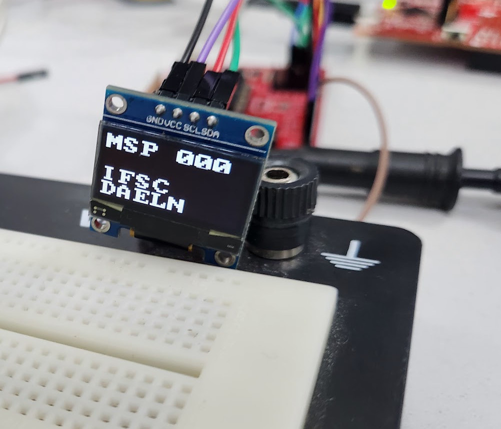

# Exemplo de aplicação com display OLED SSD1306

Este projeto é uma aplicação de exemplo que demonstra como controlar um display OLED SSD1306 utilizando o microcontrolador MSP430G2553.

### Visão Geral do Projeto

*   **Microcontrolador Principal**: **MSP430G2553**.
*   **Display**: **OLED SSD1306**.
*   **Conexões de Hardware**:
    *   O pino **SDA** do OLED é conectado a **P3.1/UCB0SDA** do MSP430.
    *   O pino **SCL** do OLED é conectado a **P3.2/UCB0SCL** do MSP430.
    *   Um **LED piscando** (para debug) está conectado a **P1.0**.

### Estrutura do Código e Funcionalidades

O projeto é estruturado com inclusões de bibliotecas e funções específicas para inicialização e operação do sistema e do display.

*   **Inclusões de Bibliotecas**:    
    *   `i2c_master_g2553.h`: Para a **comunicação I2C Master Mode**.
    *   `bits.h`, `gpio.h`: Para manipulação de bits e controle de GPIO.
    *   `ssd1366.h`: Para o controle do display SSD1306.

*   **Configuração do Sistema de Clock (`init_clock_system`)**:
    *   A função configura o sistema de clock para usar o **Digitally Controlled Oscillator (DCO)**.
    *   Utiliza **calibrações internas gravadas na flash** do microcontrolador.
    *   O código suporta configurações para diferentes frequências de DCO: **1MHz, 8MHz, 12MHz ou 16MHz**, dependendo da macro definida (e.g., `CLOCK_1MHz`, `CLOCK_8MHz`, etc.).
    *   Há uma **verificação de segurança**: se os valores de calibração na flash foram apagados (`CALBC1_XMHZ==0xFF`), a aplicação para em um `while(1)` infinito.
    *   O **ACLK (Auxiliary Clock)** é configurado para usar a fonte **VLO (~12KHz)**.

*   **Configuração do Watchdog Timer (`config_wd_as_timer`)**:
    *   O **Watchdog Timer (WDT)** é configurado para operar como um **temporizador temporizado**, não como um reset do sistema.
    *   A fonte de clock para o WDT é o **ACLK**, e o clock é dividido por 8192 (`WDTIS1+WDTIS0`).
    *   A macro `WDT_ADLY_1000` é utilizada, configurando um período de temporização de **1000ms** (aproximadamente 1 segundo).
    *   A **interrupção do Watchdog (`WDTIE`) é ativada**.

*   **Função Principal (`main`)**:
    *   **Inicialização do Sistema**:
        *   O Watchdog Timer é **desligado inicialmente** (`WDTPW | WDTHOLD`).
        *   Chamadas para inicializar o sistema de clock (`init_clock_system()`), o I2C em modo master (`init_i2c_master_mode()`), e configurar o Watchdog como temporizador (`config_wd_as_timer()`).
        *   O **LED de debug (P1.0)** é configurado como saída e ligado.
        *   Um **atraso de 160.000 ciclos** (`__delay_cycles(160000)`) é introduzido para permitir a energização e estabilização do display.
        *   Todas as **interrupções globais (GIE) são habilitadas** (`__bis_SR_register(GIE)`).
        *   O **display SSD1306 é inicializado** (`ssd1306_init()`).
    *   **Gerenciamento de Memória para o Display**:
        *   O display OLED requer **1024 bytes para o frame buffer**, mas o MSP430G2553 possui apenas **512 bytes de RAM**.
        *   Para superar essa limitação, o display é **dividido em 4 partes (linhas)**, cada uma com 256 bytes (definidas por `oled_partition_t` como `LINE_1`, `LINE_2`, etc., em `SSD1306.h`).
        *   Os pixels são **desenhados na RAM interna do MCU** e, em seguida, enviados para o display por meio da função `ssd1306_display_data(oled_partition_t line)`.
    *   **Exibição de Conteúdo Inicial**:
        *   O código escreve **"MSP"** na `LINE_1` (primeira linha), **"430"** na `LINE_2`, **"IFSC"** na `LINE_3`, e **"DAELN"** na `LINE_4`.
        *   A **fonte utilizada é 16x16 pixels**, e cada caractere é posicionado com um offset de 16 pixels nas coordenadas x e y.
    *   **Loop Principal (`while(1)`)**:
        *   Este loop é destinado à **aplicação principal**, como exibir dados de sensores ou botões.
        *   A lógica visa **atualizar apenas as variáveis alteradas** para evitar transações I2C excessivas.
        *   Um **exemplo de contador** é implementado: o texto **"MSP"** é exibido seguido por um **contador numérico (000 a 255)** na `LINE_1`.
        *   O contador (`uint16_t contador`) incrementa e é limitado a 255 (`contador &= 0xff`).
        *   O **CPU é colocado em Low Power Mode 0 (LPM0)** com interrupções habilitadas (`__bis_SR_register(LPM0_bits + GIE)`) para economizar energia, sendo acordado por uma interrupção.

*   **Rotina de Serviço de Interrupção (ISR) do Watchdog Timer (`watchdog_timer`)**:
    *   Esta ISR é executada a cada vez que o temporizador Watchdog estoura.
    *   Ela **pisca o LED** conectado a P1.0 (`PORT_OUT(LED_PORT) ^= LED;`).
    *   Contém uma lógica para **acordar a CPU do Low Power Mode** (`__bic_SR_register_on_exit(CPUOFF)`) após **duas interrupções do Watchdog** (`if (x >= 2)`).