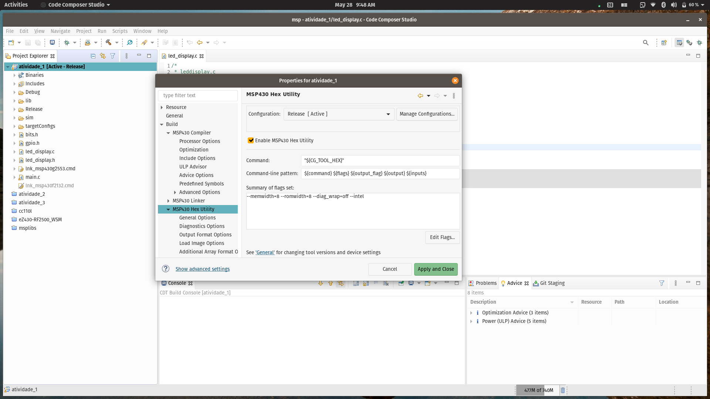
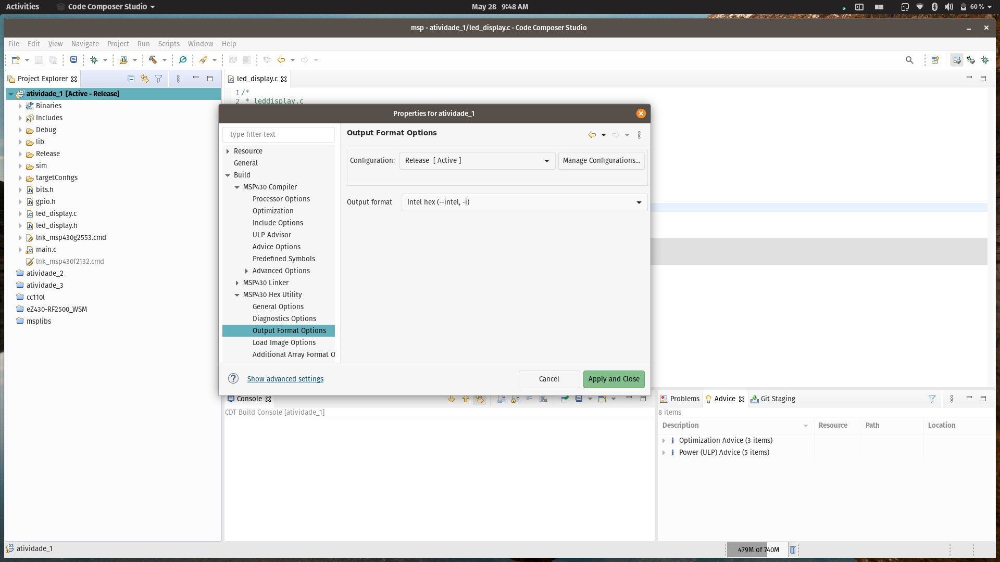
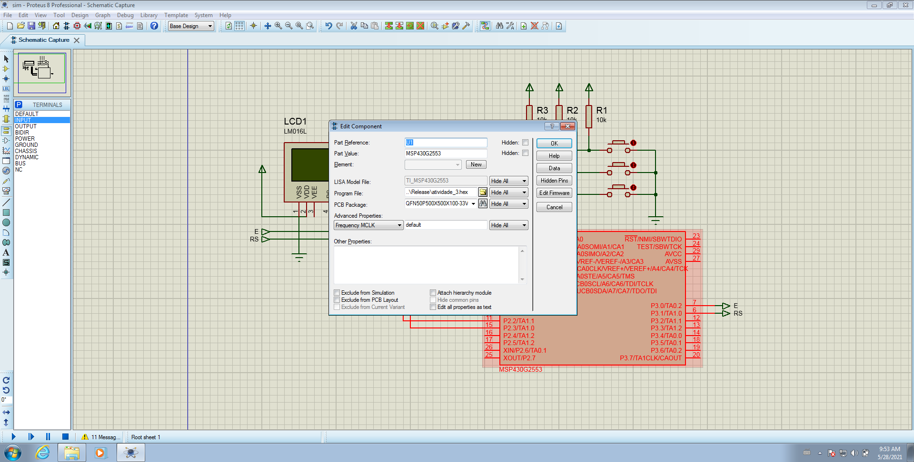

# Como simular no Proteus

1. Configurar a geração de HEX no CodeComposer. Clique com o direito no **nome do projeto** e em **Propriedades**.

2. Ir para submenu **Build** e **Hex utility**. Habilitar **Enable MSP430 Hex Utility**

3. Mudar o formato de saída para **Intel Hex**

4. Especificar o programa hex no Proteus em **Program File**:

